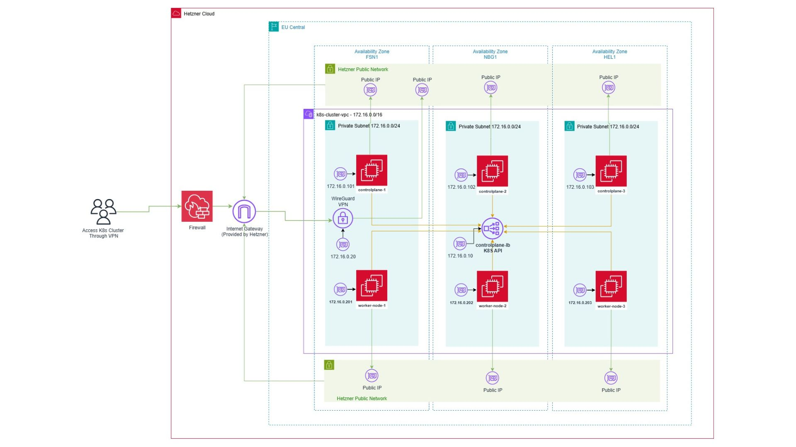
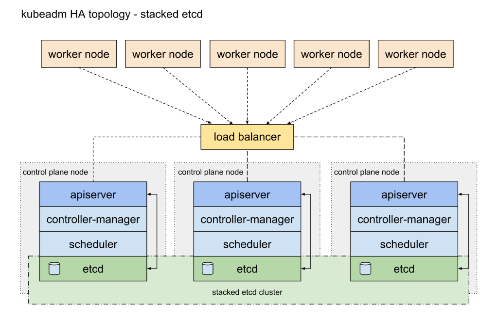
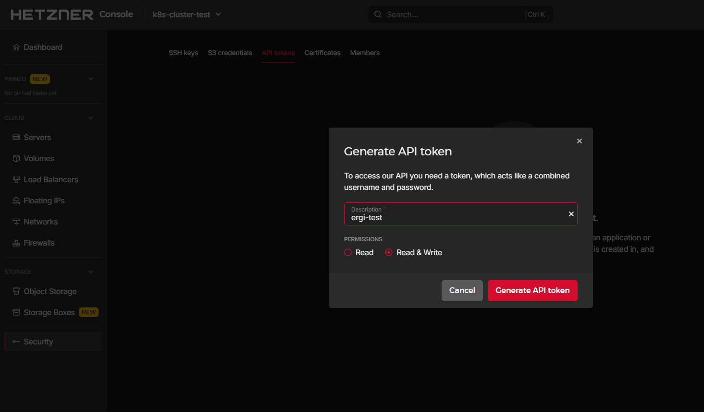
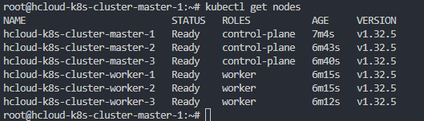
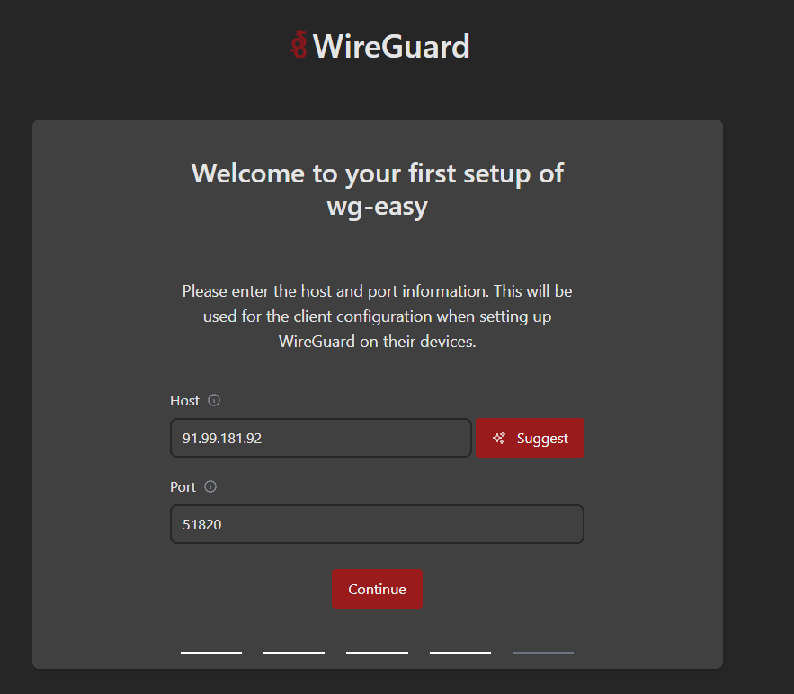
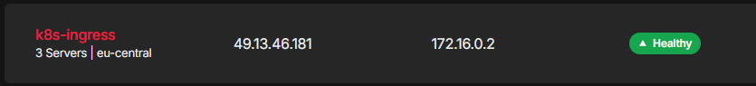
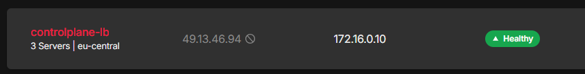

# Setup HA Kubernetes Cluster on Hetzner

This project automates the provisioning of a highly available and secure Kubernetes cluster using Terraform and Ansible. It handles the full infrastructure setup and initializes the cluster with all required components.

## Table of Contents

1. [Prerequisites](#prerequisites)
2. [Architecture](#architecture)
3. [Installation & Setup](#installation--setup)
   - [ Step 1: Create a Hetzner API Token](#create-a-hetzner-api-token)
   - [ Step 2: Generate and Add SSH Key](#generate-and-add-ssh-key)
   - [ Step 3: Deploy Infrastructure](#deploy-infrastructure)
4. [WireGuard Setup](#wireguard-setup)
5. [Load Balancer & Ingress](#load-balancer--ingress)
6. [Conclusion](#conclusion)


## Prerequisites

To deploy this project it is required:

- [Terraform](https://www.terraform.io/) >= 1.3
- [Ansible](https://www.ansible.com/) >= 2.10
- [Hetzner Cloud CLI](https://github.com/hetznercloud/cli) (optional)
- Hetzner API token
- SSH key (to access the nodes)
- **Ubuntu** (>= 24.04) or **WSL** refer to this https://learn.microsoft.com/en-us/windows/wsl/install

## Architecture
The following diagram illustrates the high-level architecture of the Kubernetes cluster deployed on Hetzner Cloud:




Kubernetes Cluster HA Architechtur:


`Image Ref: https://kubernetes.io/docs/setup/production-environment/tools/kubeadm/ha-topology/`

### Key Components:

- **WireGuard VPN**: Secure access to the private network and Kubernetes API
- **Firewall**: Limits exposure to public internet of SSH access
- **Availability Zones (FSN1, NBG1, HEL1)**: Spread across 3 Hetzner zones for high availability
- **Control Plane Nodes**: Three control planes with a load-balanced API endpoint (`controlplane-lb`)
- **Worker Nodes**: Spread across zones for resilience and scalability
- **Private Subnet**: All nodes communicate over private network (172.16.0.0/16)
- **Internet Gateway**: Provided by Hetzner for outbound access


## Installation & Setup

### Create a Hetzner API Token



1. Log in to the [Hetzner Cloud Console](https://console.hetzner.cloud/)
2. Go to **Access > API Tokens**
3. Click **Generate API Token**, give it a name, and copy it immediately

### Generate and Add SSH Key

1. Generate an SSH key (if you don't already have one):

```bash
ssh-keygen -t ed25519 -C "your_email@example.com"

```

2. Move your keys to the `keys/` directory in this project:

```
/keys
  └── my-key       (private key)
  └── my-key.pub   (public key)
```

Don't forget to give required permission 
```bash
chmod 600 ./keys/*
```

3. In `terraform.tfvars`, set the SSH key name:

```hcl
ssh_key_name = "my-key"
```

Make sure the file `keys/my-key` exists and matches the value of `ssh_key_name`.

### Deploy Infrastructure

Make sure that you hetzner cloud api key `your-key-generated` is set to variable  `hcloud_token = "your-key-generated"` on ***terraform.tfvars*** .

1. Edit and configure the variables:

```bash
nano terraform.tfvars
```

2. Initialize Terraform:

```bash
terraform init
```

3. Review planned changes:

```bash
terraform plan
```

4. Apply the infrastructure:

```bash
terraform apply
```

#### ✅ After some minutes everything it will be ready.



### WireGuard Setup

Once the cluster is deployed, use `wg-easy` to set up and manage VPN access:

1. Open your browser and navigate to the public IP of the WireGuard node on port `51821`
2. Enter the host (public IP) and port (`51820`) in the setup screen:



3. Click **Continue** to proceed with the server configuration.
4. From the dashboard, you can add VPN clients by clicking **"Create new client"**, assigning a name, and downloading their configuration.
5. Import the configuration into your WireGuard client on desktop or mobile to connect.

Ref: [WireGuard Easy](https://github.com/wg-easy/wg-easy)

### Load Balancer & Ingress

#### Ingress Load Balancer
The ingress controller is deployed behind a public load balancer using Hetzner Cloud Load Balancer service. After successful deployment:

- You will see a public IP assigned to the load balancer
- This IP routes traffic to the internal IP (e.g., `172.16.0.2`) of your `nginx-ingress` service



You can now use the public IP to route traffic into your cluster using DNS records. Make sure to configure your ingress rules and TLS certificates properly (e.g., with cert-manager).

#### Control Plane Load Balancer

A Hetzner Load Balancer is also provisioned to balance traffic between all control plane nodes. It provides a stable endpoint for the Kubernetes API (on port 6443) and forwards traffic to the internal control plane IPs.



This load balancer ensures high availability and reliability for Kubernetes control plane operations.

### Conclusion

By the end of this setup, you'll have a production-ready, highly available Kubernetes cluster on Hetzner Cloud. Secure access is provided via WireGuard VPN, and traffic to your applications is managed through an NGINX ingress controller exposed by a public load balancer. The control plane is also load-balanced, ensuring stable and resilient cluster operations.